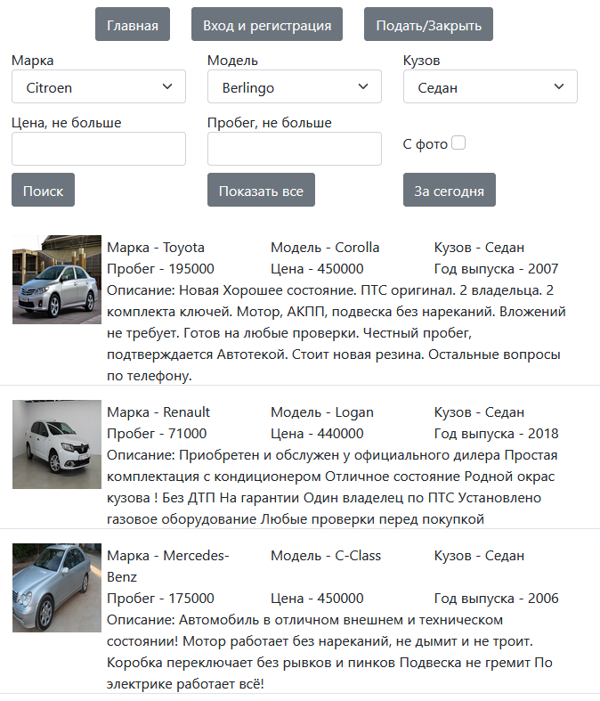
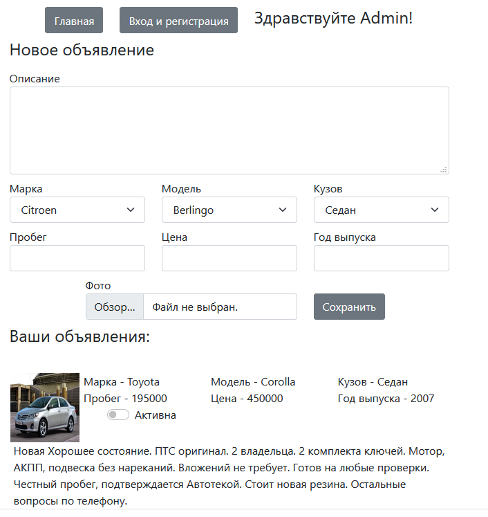
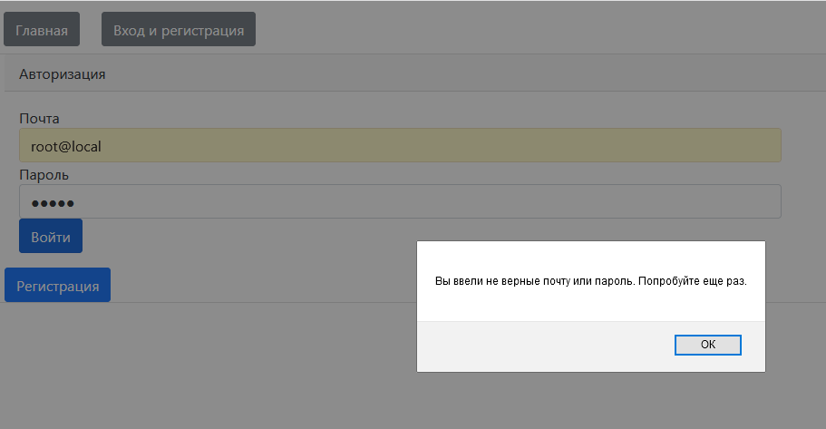
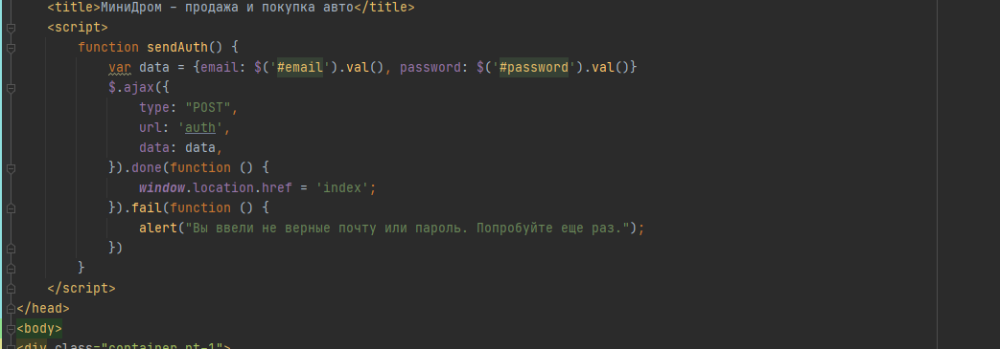

# Цель проекта
Данный проект создавался для отработки изученного материала по Hibernate, HQL, аннотаций, реализации связей между сущностями, а также паттернов проектирования.
Проект написан с использованием Lombok.
# Описание проекта
Проект представляет собой подобие сайтов (на минималках) по размещению авто с целью покупки/продажи.
На главной странице вы видите все актуальные объявления и форму для поиска по заданным параметрам. 
В зависимости от выбранных фильтров вы увидите соответствующие объявления.

При попытке подать или закрыть объявление происходит проверка на авторизацию и в случае отсутствия сесси вы попадете на страницу входа.
Успешно войдя в систему в разделе подать/закрыть вы увидите только ваши объявления и сможете их закрыть, а также подать новое объявление.

В случае ошибки при вводе логи/пароля, а также регистрации по уже существующему логину появится предупреждение.

Информацию на страницу загружается через Ajax. Post запросы также осуществляются через Ajax. Например авторизация

# Запуск проекта
Для запуска потребуется PostgreSQL.
В resources вы найдете конфигурационный файл Hibernate в котором необходимо указать корректные данный для подключения к БД.
При необходимости, для создания таблиц, можете воспользоваться sql скриптом в resources.db.
Для демонстрации работы приложения, можете загрузить в БД первоначальные данные, из папки resources.data.
Сконфигурировать Tomcat
